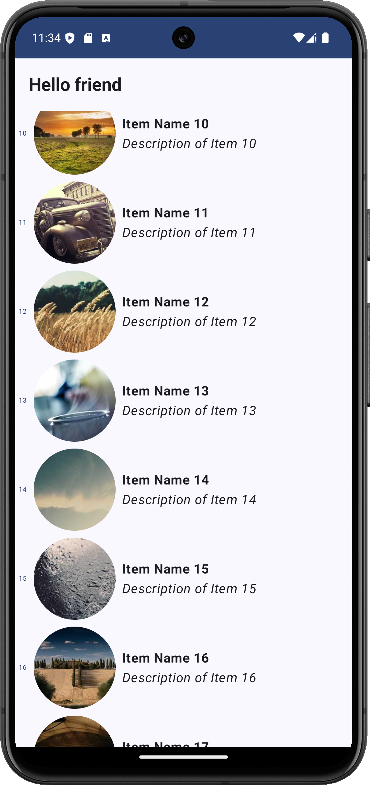

This is the app for the technical interview for Mondly @ Pearson

**Pearson Inteview** is an Android app built with Kotlin and Jetpack Compose. It
follows Android design and development best practices.



Decisions
=
The main decision for this app is to use the API as the source of truth for the information. As the API has not implemented pagination or any update reference, I decided to avoid implementing Room to show the local and remote control of information (it looks unnecessary and forced).
The app gets the answer from the API and handles the internet connection to help the user retrieve a snack bar message, also if there is nothing to show, have the chance to refresh the list after the connection is back.

For the model of the app, the domain used model is the **Item**...
```code
data class Item(
    val id: String,
    val name: String,
    val description: String,
    val imageUrl: String
)
```
...but, as the API has a specific model, the network layer handles these specific "API side items" (check it [here](core/network/src/main/java/com/uforpablo/network/model/APIModel.kt)) to get the answer and then be parsed to the domain specifics in the repository

Libraries & tech stack
=
- Kotlin based + Coroutines + Flow
- Jetpack libraries
  - Jetpack compose: Android's modern toolkit for UI development
  - ViewModel: Manages UI data, encapsulates the lifecycle-aware
  - Hilt: Dependency injection specifically designed for Android
- Architecture
  - MVVM: Ensuring a clear separation of concerns and fostering maintainability
  - Repository Pattern: Mediate between data source and the application's business logic.
  - Multimodule: Each module encapsulates specific features or components, promoting separation of concerns and facilitating collaboration among developers. 
-  Coil: Image loader async for Compose
-  Retrofit: REST API data retrieval
- Sandwich: Lightweight library that helps to handle the API responses and exception in Kotlin for Retrofit
- Gson: Json deserializer library
- Turbine: A simple testing library for kotlinx.coroutines Flow
